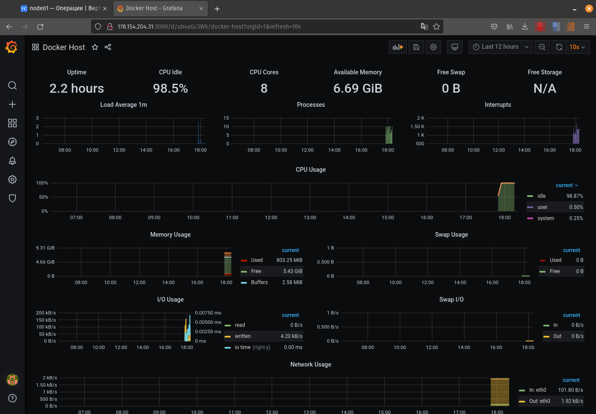

# Домашнее задание к занятию "5.4. Оркестрация группой Docker контейнеров на примере Docker Compose"


---

## Задача 1

Создать собственный образ операционной системы с помощью Packer.

Для получения зачета, вам необходимо предоставить:
- Скриншот страницы, как на слайде из презентации (слайд 37).

```
(base):~/GIT/virt-homeworks/05-virt-04-docker-compose/src/packer$ yc compute image list

+----------------------+---------------+--------+----------------------+--------+
|          ID          |     NAME      | FAMILY |     PRODUCT IDS      | STATUS |
+----------------------+---------------+--------+----------------------+--------+
| fd8fled25kvd6f2iudq2 | centos-7-base | centos | f2epin40q8nh7fqdv3sh | READY  |
+----------------------+---------------+--------+----------------------+--------+

```


---

## Задача 2

Создать вашу первую виртуальную машину в Яндекс.Облаке.

Для получения зачета, вам необходимо предоставить:
- Скриншот страницы свойств созданной ВМ, как на примере ниже:


---
### Скриншот свойств созданной ВМ


### Лог создания ВМ
```
(base):~/GIT/virt-homeworks/05-virt-04-docker-compose/src/terraform$ terraform plan

Terraform used the selected providers to generate the following execution plan. Resource actions are indicated with the following symbols:
  + create

Terraform will perform the following actions:

  # yandex_compute_instance.node01 will be created
  + resource "yandex_compute_instance" "node01" {
      + allow_stopping_for_update = true
      + created_at                = (known after apply)
      + folder_id                 = (known after apply)
      + fqdn                      = (known after apply)
      + hostname                  = "node01.netology.cloud"
      + id                        = (known after apply)
      + metadata                  = {
          + "ssh-keys" = <<-EOT
                centos:ssh-rsa AAAAB3NzaC1yc2EAAAADAQABAAABAQCeDtGCENLacQjlKM3ozFRUNUDjgYswdW2vz+jRP95VYrz4mRV3LwISslGGtIsD59aLt79vzFdNNDWdW1Hc0Ut6xk4G7OurFqsI4cv6V3fO4Kji2OeCOMAapunWN9Ov9/n//vEWxeI1w66YrwPRRxDmDmCPP/Uxv1D9JGYO62vWCZ2DQJxYZHgKzPyGvZYNg9RltZcUCHF5V4bRoJpsR7cYZPnLzwdgbu3Ln3HKV2UrF3dPo35m0HBSqVyPTIvoMLrQaN96OLf1Ajk+9LCREWkQzhzWpQgnU5pOM1jfKEKGRdMhLxmG8P4JA3HL76KCrVRPbA/HYmk76fBI0X7qYq0j terraform@centos
            EOT
        }
      + name                      = "node01"
      + network_acceleration_type = "standard"
      + platform_id               = "standard-v1"
      + service_account_id        = (known after apply)
      + status                    = (known after apply)
      + zone                      = "ru-central1-a"

      + boot_disk {
          + auto_delete = true
          + device_name = (known after apply)
          + disk_id     = (known after apply)
          + mode        = (known after apply)

          + initialize_params {
              + block_size  = (known after apply)
              + description = (known after apply)
              + image_id    = "fd8fled25kvd6f2iudq2"
              + name        = "root-node01"
              + size        = 50
              + snapshot_id = (known after apply)
              + type        = "network-nvme"
            }
        }

      + network_interface {
          + index              = (known after apply)
          + ip_address         = (known after apply)
          + ipv4               = true
          + ipv6               = (known after apply)
          + ipv6_address       = (known after apply)
          + mac_address        = (known after apply)
          + nat                = true
          + nat_ip_address     = (known after apply)
          + nat_ip_version     = (known after apply)
          + security_group_ids = (known after apply)
          + subnet_id          = (known after apply)
        }

      + placement_policy {
          + placement_group_id = (known after apply)
        }

      + resources {
          + core_fraction = 100
          + cores         = 8
          + memory        = 8
        }

      + scheduling_policy {
          + preemptible = (known after apply)
        }
    }

  # yandex_vpc_network.default will be created
  + resource "yandex_vpc_network" "default" {
      + created_at                = (known after apply)
      + default_security_group_id = (known after apply)
      + folder_id                 = (known after apply)
      + id                        = (known after apply)
      + labels                    = (known after apply)
      + name                      = "net"
      + subnet_ids                = (known after apply)
    }

  # yandex_vpc_subnet.default will be created
  + resource "yandex_vpc_subnet" "default" {
      + created_at     = (known after apply)
      + folder_id      = (known after apply)
      + id             = (known after apply)
      + labels         = (known after apply)
      + name           = "subnet"
      + network_id     = (known after apply)
      + v4_cidr_blocks = [
          + "192.168.101.0/24",
        ]
      + v6_cidr_blocks = (known after apply)
      + zone           = "ru-central1-a"
    }

Plan: 3 to add, 0 to change, 0 to destroy.

Changes to Outputs:
  + external_ip_address_node01_yandex_cloud = (known after apply)
  + internal_ip_address_node01_yandex_cloud = (known after apply)

```

```
Apply complete! Resources: 3 added, 0 changed, 0 destroyed.

Outputs:

external_ip_address_node01_yandex_cloud = "178.154.204.31"
internal_ip_address_node01_yandex_cloud = "192.168.101.23"


```

---

## Задача 3

Создать ваш первый готовый к боевой эксплуатации компонент мониторинга, состоящий из стека микросервисов.

Для получения зачета, вам необходимо предоставить:
- Скриншот работающего веб-интерфейса Grafana с текущими метриками, как на примере ниже


### Скриншот готового компонента мониторинга


### Список работающих docker-контейнеров
```
[root@node01 stack]# docker ps
CONTAINER ID   IMAGE                                       COMMAND                  CREATED          STATUS                    PORTS                                                                              NAMES
63659187c630   prom/prometheus:v2.17.1                     "/bin/prometheus --c…"   36 minutes ago   Up 36 minutes             9090/tcp                                                                           prometheus
c580917d8d81   prom/node-exporter:v0.18.1                  "/bin/node_exporter …"   36 minutes ago   Up 36 minutes             9100/tcp                                                                           nodeexporter
feffdaac344d   stefanprodan/caddy                          "/sbin/tini -- caddy…"   36 minutes ago   Up 36 minutes             0.0.0.0:3000->3000/tcp, 0.0.0.0:9090-9091->9090-9091/tcp, 0.0.0.0:9093->9093/tcp   caddy
95074e14c36a   prom/alertmanager:v0.20.0                   "/bin/alertmanager -…"   36 minutes ago   Up 36 minutes             9093/tcp                                                                           alertmanager
d20dc05f54a3   grafana/grafana:7.4.2                       "/run.sh"                36 minutes ago   Up 36 minutes             3000/tcp                                                                           grafana
02a54b58f945   gcr.io/google-containers/cadvisor:v0.34.0   "/usr/bin/cadvisor -…"   36 minutes ago   Up 36 minutes (healthy)   8080/tcp                                                                           cadvisor
bcb30d237345   prom/pushgateway:v1.2.0                     "/bin/pushgateway"       36 minutes ago   Up 36 minutes             9091/tcp                                                                           pushgateway

```

### Список docker-volumes
```
[root@node01 stack]# docker volume ls
DRIVER    VOLUME NAME
local     9b76e27e6f9c67f4a85e9aad56304fca0d1778c7494590ffee92c8d3fb1b6bcb
local     32b7795b8938a8ba11775558f325a53c96d977695e4ade479be4f22ff8552076
local     stack_grafana_data
local     stack_prometheus_data

```
---

## Задача 4 (*)

Создать вторую ВМ и подключить её к мониторингу развёрнутому на первом сервере.

Для получения зачета, вам необходимо предоставить:
- Скриншот из Grafana, на котором будут отображаться метрики добавленного вами сервера.

```
(base):~/GIT/virt-homeworks/05-virt-04-docker-compose/src/terraform-node-02$ terraform plan

Terraform used the selected providers to generate the following execution plan. Resource actions are indicated with the following symbols:
  + create

Terraform will perform the following actions:

  # yandex_compute_instance.node02 will be created
  + resource "yandex_compute_instance" "node02" {
      + allow_stopping_for_update = true
      + created_at                = (known after apply)
      + folder_id                 = (known after apply)
      + fqdn                      = (known after apply)
      + hostname                  = "node02.netology.cloud"
      + id                        = (known after apply)
      + metadata                  = {
          + "ssh-keys" = <<-EOT
                centos:ssh-rsa AAAAB3NzaC1yc2EAAAADAQABAAABAQCeDtGCENLacQjlKM3ozFRUNUDjgYswdW2vz+jRP95VYrz4mRV3LwISslGGtIsD59aLt79vzFdNNDWdW1Hc0Ut6xk4G7OurFqsI4cv6V3fO4Kji2OeCOMAapunWN9Ov9/n//vEWxeI1w66YrwPRRxDmDmCPP/Uxv1D9JGYO62vWCZ2DQJxYZHgKzPyGvZYNg9RltZcUCHF5V4bRoJpsR7cYZPnLzwdgbu3Ln3HKV2UrF3dPo35m0HBSqVyPTIvoMLrQaN96OLf1Ajk+9LCREWkQzhzWpQgnU5pOM1jfKEKGRdMhLxmG8P4JA3HL76KCrVRPbA/HYmk76fBI0X7qYq0j terraform@centos
            EOT
        }
      + name                      = "node02"
      + network_acceleration_type = "standard"
      + platform_id               = "standard-v1"
      + service_account_id        = (known after apply)
      + status                    = (known after apply)
      + zone                      = "ru-central1-a"

      + boot_disk {
          + auto_delete = true
          + device_name = (known after apply)
          + disk_id     = (known after apply)
          + mode        = (known after apply)

          + initialize_params {
              + block_size  = (known after apply)
              + description = (known after apply)
              + image_id    = "fd8fled25kvd6f2iudq2"
              + name        = "root-node02"
              + size        = 20
              + snapshot_id = (known after apply)
              + type        = "network-nvme"
            }
        }

      + network_interface {
          + index              = (known after apply)
          + ip_address         = (known after apply)
          + ipv4               = true
          + ipv6               = (known after apply)
          + ipv6_address       = (known after apply)
          + mac_address        = (known after apply)
          + nat                = true
          + nat_ip_address     = (known after apply)
          + nat_ip_version     = (known after apply)
          + security_group_ids = (known after apply)
          + subnet_id          = (known after apply)
        }

      + placement_policy {
          + placement_group_id = (known after apply)
        }

      + resources {
          + core_fraction = 100
          + cores         = 4
          + memory        = 4
        }

      + scheduling_policy {
          + preemptible = (known after apply)
        }
    }

  # yandex_vpc_network.default will be created
  + resource "yandex_vpc_network" "default" {
      + created_at                = (known after apply)
      + default_security_group_id = (known after apply)
      + folder_id                 = (known after apply)
      + id                        = (known after apply)
      + labels                    = (known after apply)
      + name                      = "net"
      + subnet_ids                = (known after apply)
    }

  # yandex_vpc_subnet.default will be created
  + resource "yandex_vpc_subnet" "default" {
      + created_at     = (known after apply)
      + folder_id      = (known after apply)
      + id             = (known after apply)
      + labels         = (known after apply)
      + name           = "subnet"
      + network_id     = (known after apply)
      + v4_cidr_blocks = [
          + "192.168.101.0/24",
        ]
      + v6_cidr_blocks = (known after apply)
      + zone           = "ru-central1-a"
    }

Plan: 3 to add, 0 to change, 0 to destroy.

Changes to Outputs:
  + external_ip_address_node02_yandex_cloud = (known after apply)
  + internal_ip_address_node02_yandex_cloud = (known after apply)


```