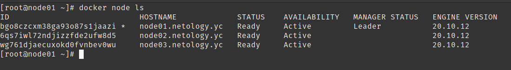
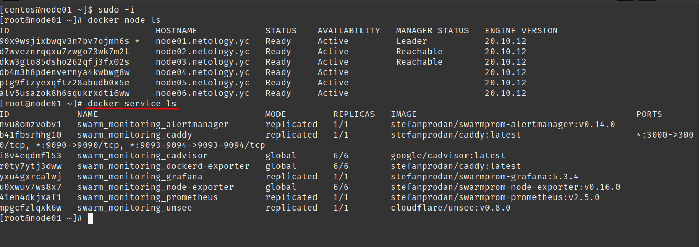
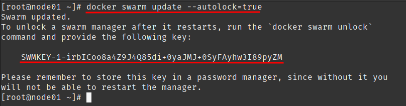

# Домашнее задание к занятию "5.5. Оркестрация кластером Docker контейнеров на примере Docker Swarm"

---

## Задача 1

Дайте письменые ответы на следующие вопросы:

- В чём отличие режимов работы сервисов в Docker Swarm кластере: replication и global?
> В режиме работы `replication` сервисы реплицируются по кластеру между контейнерами в заданном количестве - например при запуске веб-сервера или АПИ запуск в этом режиме позволяет балансировать нагрузку между контейнерами;
> В режиме работы `global` сервисы запускаются в единичном экземпляре - например сервис мониторинга;
- Какой алгоритм выбора лидера используется в Docker Swarm кластере?
> В `Docker Swarm` при выборе лидера используется алгоритм RAFT consensus, обеспечивающий реализацию машины состояний с помощью голосования с ограниченным сроком действия ;
- Что такое Overlay Network?
> `Overlay Network` - это подсеть, реализованная с помощью технологии `vxlan`, для связи контейнеров находящихся на разных физических хостах;
> 
## Задача 2

Создать ваш первый Docker Swarm кластер в Яндекс.Облаке

Для получения зачета, вам необходимо предоставить скриншот из терминала (консоли), с выводом команды:
```
docker node ls
```



## Задача 3

Создать ваш первый, готовый к боевой эксплуатации кластер мониторинга, состоящий из стека микросервисов.

Для получения зачета, вам необходимо предоставить скриншот из терминала (консоли), с выводом команды:
```
docker service ls
```


## Задача 4 (*)

Выполнить на лидере Docker Swarm кластера команду (указанную ниже) и дать письменное описание её функционала, что она делает и зачем она нужна:
```
# см.документацию: https://docs.docker.com/engine/swarm/swarm_manager_locking/
docker swarm update --autolock=true
```



> Команда включает автоблокировку ключа взаимного шифрования и ключа шифрования журналов  формируемых в процессе работы алгоритма Raft.
> В случае рестарта системы необходимо разблокировать кластер с помощью команды `docker swarm unlock` и ввода ключа `SWMKEY-1-irbICoo8a4Z9J4Q85di+0yaJMJ+0SyFAyhw3I89pyZM` .
