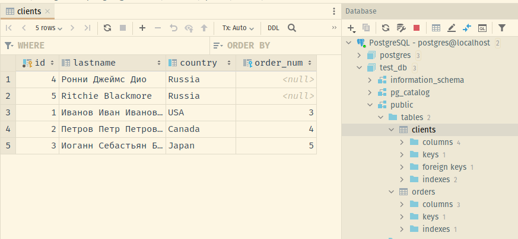
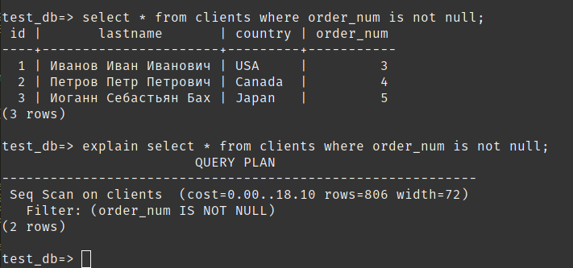

# Домашнее задание к занятию "6.2. SQL"

## DOCKER-COMPOSE
Решение Задач 1..4 приведено в `docker-compose.yaml` ниже:

```
version: '3.9'
services:
  postgres:
    image: postgres:12
    restart: always
    environment:
      - POSTGRES_USER=postgres
      - POSTGRES_PASSWORD=postgres
    logging:
      options:
        max-size: 10m
        max-file: "3"
    ports:
      - '5432:5432'
    volumes:
      - ./volume01:/var/lib/postgresql/data
      - ./volume02:/var/lib/postgresql/
      - ./init-db-user-data-orders.sh:/docker-entrypoint-initdb.d/init-db.sh
       
```
Соответствующий скрипт выполняет операции с БД PostgreSQL:
```
#!/bin/bash
set -e

psql -v ON_ERROR_STOP=1 --username "$POSTGRES_USER" --dbname "$POSTGRES_DB" <<-EOSQL
	
	-- Создание пользователей и БД
	CREATE USER "test-admin-user";
	CREATE DATABASE test_db ENCODING "UTF-8";
	GRANT CONNECT ON DATABASE test_db to "test-admin-user";

	\c test_db;

	CREATE TABLE IF NOT EXISTS orders (
	id serial PRIMARY KEY, 
	name text, 
	price integer 
	);

	-- Создание таблиц БД
	CREATE TABLE IF NOT EXISTS clients (
		id serial PRIMARY KEY,
		lastname text,
		country text,
		order_num integer,
		FOREIGN KEY (order_num) REFERENCES orders (Id)
	);

	CREATE INDEX ON clients(country);

	
	GRANT ALL PRIVILEGES ON DATABASE test_db TO "test-admin-user";
	GRANT ALL PRIVILEGES ON clients, orders TO "test-admin-user"; 


	CREATE ROLE "test-simple-user";
	GRANT CONNECT ON DATABASE test_db to "test-simple-user";
	GRANT SELECT, INSERT, UPDATE, DELETE ON TABLE public.clients TO "test-simple-user";
	GRANT SELECT, INSERT, UPDATE, DELETE ON TABLE public.orders TO "test-simple-user";

	-- Добавление информации в созданные таблицы
	INSERT INTO orders (name,price)
	VALUES ('Шоколад',10),('Принтер',3000),('Книга',500),('Монитор',7000),('Гитара',4000)
	ON CONFLICT (id) DO NOTHING;

	INSERT INTO clients (lastname,country) 
	VALUES ('Иванов Иван Иванович','USA'),('Петров Петр Петрович','Canada'),('Иоганн Себастьян Бах','Japan'),('Ронни Джеймс Дио','Russia'),('Ritchie Blackmore','Russia')
	ON CONFLICT (id) DO NOTHING;

	-- Создание заказов Клиентами
	UPDATE clients SET order_num=(select id from orders where name like 'Книга') where id=(select id from clients where lastname like 'Иванов Иван Иванович');
	UPDATE clients SET order_num=(select id from orders where name like 'Монитор') where id=(select id from clients where lastname like 'Петров Петр Петрович');
	UPDATE clients SET order_num=(select id from orders where name like 'Гитара') where id=(select id from clients where lastname like 'Иоганн Себастьян Бах');
EOSQL

```

Скриншот test_db:


Скриншот SQL-запроса для выдачи всех пользователей, которые совершили заказ, а также вывод данного запроса: 


> 
> Прошу перейти в раздел **Задача 5** >>
> 
## Задача 1

Используя docker поднимите инстанс PostgreSQL (версию 12) c 2 volume, 
в который будут складываться данные БД и бэкапы.

Приведите получившуюся команду или docker-compose манифест.

## Задача 2

В БД из задачи 1: 
- создайте пользователя test-admin-user и БД test_db
- в БД test_db создайте таблицу orders и clients (спeцификация таблиц ниже)
- предоставьте привилегии на все операции пользователю test-admin-user на таблицы БД test_db
- создайте пользователя test-simple-user  
- предоставьте пользователю test-simple-user права на SELECT/INSERT/UPDATE/DELETE данных таблиц БД test_db

Таблица orders:
- id (serial primary key)
- наименование (string)
- цена (integer)

Таблица clients:
- id (serial primary key)
- фамилия (string)
- страна проживания (string, index)
- заказ (foreign key orders)

Приведите:
- итоговый список БД после выполнения пунктов выше,
- описание таблиц (describe)
- SQL-запрос для выдачи списка пользователей с правами над таблицами test_db
- список пользователей с правами над таблицами test_db

## Задача 3

Используя SQL синтаксис - наполните таблицы следующими тестовыми данными:

Таблица orders

|Наименование|цена|
|------------|----|
|Шоколад| 10 |
|Принтер| 3000 |
|Книга| 500 |
|Монитор| 7000|
|Гитара| 4000|

Таблица clients

|ФИО|Страна проживания|
|------------|----|
|Иванов Иван Иванович| USA |
|Петров Петр Петрович| Canada |
|Иоганн Себастьян Бах| Japan |
|Ронни Джеймс Дио| Russia|
|Ritchie Blackmore| Russia|

Используя SQL синтаксис:
- вычислите количество записей для каждой таблицы 
- приведите в ответе:
    - запросы 
    - результаты их выполнения.

## Задача 4

Часть пользователей из таблицы clients решили оформить заказы из таблицы orders.

Используя foreign keys свяжите записи из таблиц, согласно таблице:

|ФИО|Заказ|
|------------|----|
|Иванов Иван Иванович| Книга |
|Петров Петр Петрович| Монитор |
|Иоганн Себастьян Бах| Гитара |

Приведите SQL-запросы для выполнения данных операций.

Приведите SQL-запрос для выдачи всех пользователей, которые совершили заказ, а также вывод данного запроса.
 
Подсказк - используйте директиву `UPDATE`.

## Задача 5

Получите полную информацию по выполнению запроса выдачи всех пользователей из задачи 4 
(используя директиву EXPLAIN).

Приведите получившийся результат и объясните что значат полученные значения.


> 
> Seq Scan последовательное, блок за блоком, чтение данных таблицы `clients` 
> cost=0.00..18.10 - затраты на получение первой и всех строк соотвественно
> rows=806 - приблизительное количество возвращаемых строк при выполнении операции
> width=72 - средний размер одной строки в байтах
> 

## Задача 6

Создайте бэкап БД test_db и поместите его в volume, предназначенный для бэкапов (см. Задачу 1).

Остановите контейнер с PostgreSQL (но не удаляйте volumes).

Поднимите новый пустой контейнер с PostgreSQL.

Восстановите БД test_db в новом контейнере.

Приведите список операций, который вы применяли для бэкапа данных и восстановления. 

---

### Как cдавать задание

Выполненное домашнее задание пришлите ссылкой на .md-файл в вашем репозитории.

---
