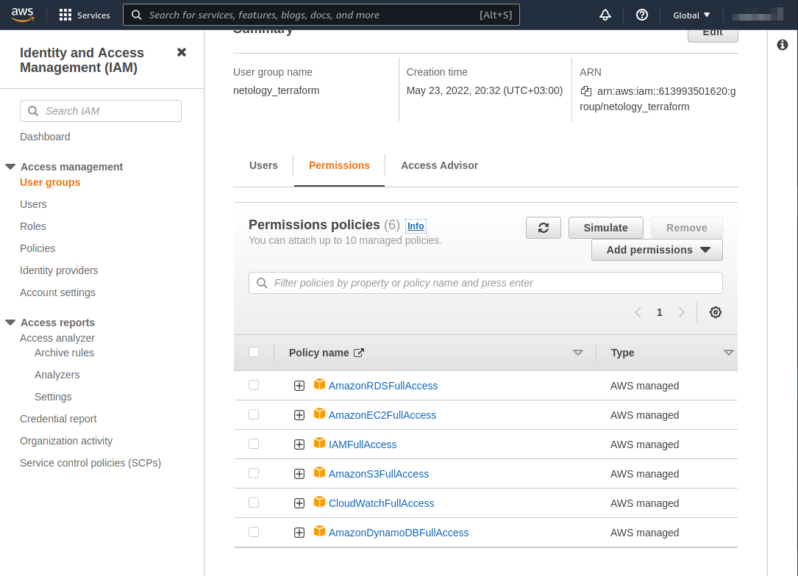
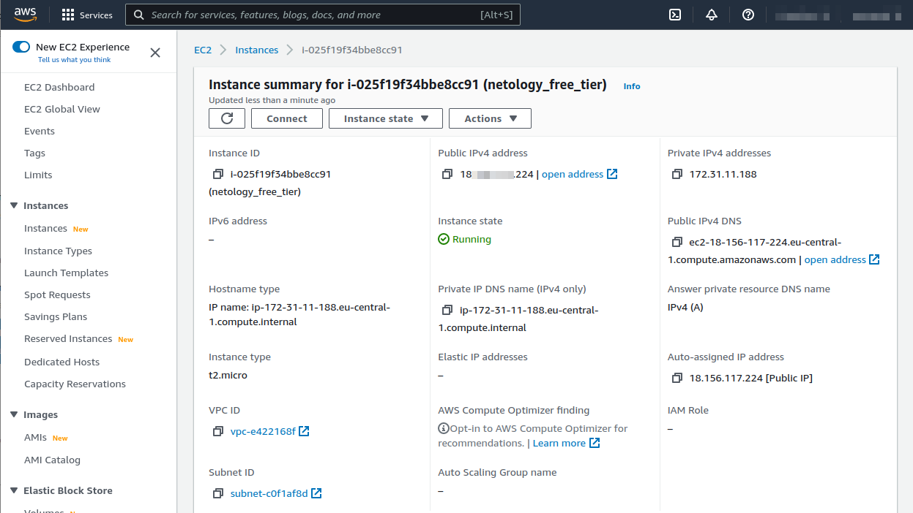
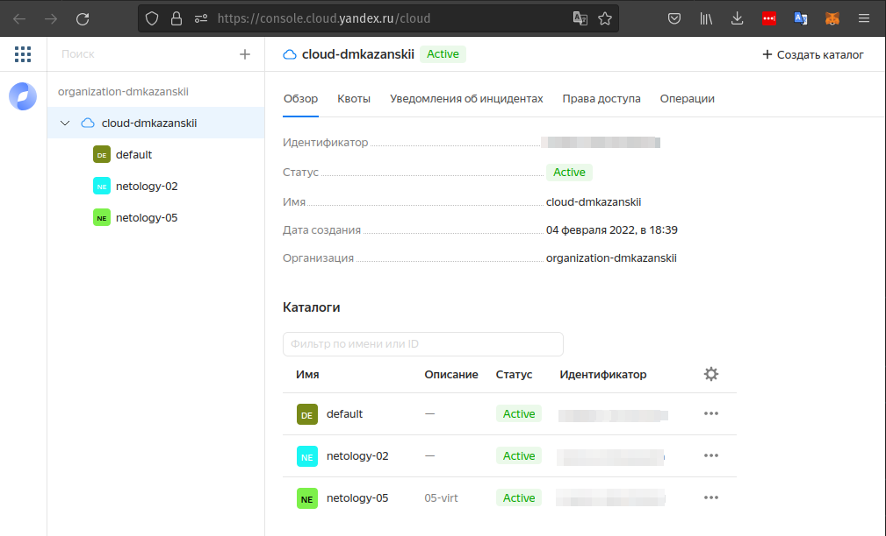
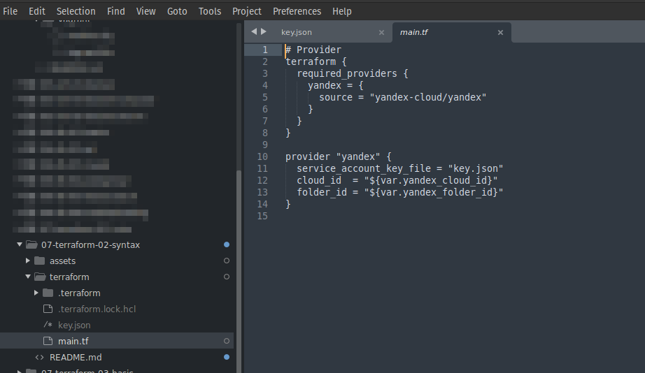

# Домашнее задание к занятию "7.2. Облачные провайдеры и синтаксис Terraform."

Зачастую разбираться в новых инструментах гораздо интересней понимая то, как они работают изнутри. 
Поэтому в рамках первого *необязательного* задания предлагается завести свою учетную запись в AWS (Amazon Web Services) или Yandex.Cloud.
Идеально будет познакомится с обоими облаками, потому что они отличаются. 

## Задача 1 (вариант с AWS). Регистрация в aws и знакомство с основами (необязательно, но крайне желательно).

Остальные задания можно будет выполнять и без этого аккаунта, но с ним можно будет увидеть полный цикл процессов. 

AWS предоставляет достаточно много бесплатных ресурсов в первый год после регистрации, подробно описано [здесь](https://aws.amazon.com/free/).
1. Создайте аккаут aws.
1. Установите c aws-cli https://aws.amazon.com/cli/.
1. Выполните первичную настройку aws-sli https://docs.aws.amazon.com/cli/latest/userguide/cli-configure-quickstart.html.
1. Создайте IAM политику для терраформа c правами
    * AmazonEC2FullAccess
    * AmazonS3FullAccess
    * AmazonDynamoDBFullAccess
    * AmazonRDSFullAccess
    * CloudWatchFullAccess
    * IAMFullAccess
> 
> 
> 
1. Добавьте переменные окружения 
    ```
    export AWS_ACCESS_KEY_ID=(your access key id)
    export AWS_SECRET_ACCESS_KEY=(your secret access key)
    ```
1. Создайте, остановите и удалите ec2 инстанс (любой с пометкой `free tier`) через веб интерфейс. 
> 
> 
> 

В виде результата задания приложите вывод команды `aws configure list`.

> 
> 
```bash
(base):~$ aws configure list
      Name                    Value             Type    Location
      ----                    -----             ----    --------
   profile                <not set>             None    None
access_key     ****************4GP4              env    
secret_key     ****************PAQT              env    
    region             eu-central-1      config-file    ~/.aws/config

```
> 
> 

## Задача 1 (Вариант с Yandex.Cloud). Регистрация в ЯО и знакомство с основами (необязательно, но крайне желательно).

1. Подробная инструкция на русском языке содержится [здесь](https://cloud.yandex.ru/docs/solutions/infrastructure-management/terraform-quickstart).
2. Обратите внимание на период бесплатного использования после регистрации аккаунта. 
3. Используйте раздел "Подготовьте облако к работе" для регистрации аккаунта. Далее раздел "Настройте провайдер" для подготовки
базового терраформ конфига.
> 
> 
> 
4. Воспользуйтесь [инструкцией](https://registry.terraform.io/providers/yandex-cloud/yandex/latest/docs) на сайте терраформа, что бы 
не указывать авторизационный токен в коде, а терраформ провайдер брал его из переменных окружений.
> 
>  
> 

## Задача 2. Создание aws ec2 или yandex_compute_instance через терраформ. 

1. В каталоге `terraform` вашего основного репозитория, который был создан в начале курсе, создайте файл `main.tf` и `versions.tf`.
2. Зарегистрируйте провайдер 
   1. для [aws](https://registry.terraform.io/providers/hashicorp/aws/latest/docs). В файл `main.tf` добавьте
   блок `provider`, а в `versions.tf` блок `terraform` с вложенным блоком `required_providers`. Укажите любой выбранный вами регион 
   внутри блока `provider`.

```bash
$ terraform init

Initializing the backend...

Initializing provider plugins...
- Finding hashicorp/aws versions matching "~> 3.0"...
- Installing hashicorp/aws v3.75.2...
- Installed hashicorp/aws v3.75.2 (signed by HashiCorp)

Terraform has created a lock file .terraform.lock.hcl to record the provider
selections it made above. Include this file in your version control repository
so that Terraform can guarantee to make the same selections by default when
you run "terraform init" in the future.

Terraform has been successfully initialized!

```
> 
 
   2. либо для [yandex.cloud](https://registry.terraform.io/providers/yandex-cloud/yandex/latest/docs). Подробную инструкцию можно найти 
   [здесь](https://cloud.yandex.ru/docs/solutions/infrastructure-management/terraform-quickstart).

```bash
$ terraform init

Initializing the backend...

Initializing provider plugins...
- Finding latest version of yandex-cloud/yandex...
- Installing yandex-cloud/yandex v0.74.0...
- Installed yandex-cloud/yandex v0.74.0 (self-signed, key ID E40F590B50BB8E40)

Partner and community providers are signed by their developers.
If you'd like to know more about provider signing, you can read about it here:
https://www.terraform.io/docs/cli/plugins/signing.html

Terraform has created a lock file .terraform.lock.hcl to record the provider
selections it made above. Include this file in your version control repository
so that Terraform can guarantee to make the same selections by default when
you run "terraform init" in the future.

Terraform has been successfully initialized!

```
> 

3. Внимание! В гит репозиторий нельзя пушить ваши личные ключи доступа к аккаунту. Поэтому в предыдущем задании мы указывали
их в виде переменных окружения. 
4. В файле `main.tf` воспользуйтесь блоком `data "aws_ami` для поиска ami образа последнего Ubuntu.  

```json
# main.tf
....
# фильтр для использования последней версии образа
data "aws_ami" "ubuntu" {
  most_recent = true

  filter {
    name = "name"
    values = ["*ubuntu*"]
  }

  filter {
    name   = "virtualization-type"
    values = ["hvm"]
  }
  filter {
    name = "architecture"
    values = ["x86_64"]
  }

  owners = ["099720109477"]
}
```

5. В файле `main.tf` создайте рессурс 
   1. либо [ec2 instance](https://registry.terraform.io/providers/hashicorp/aws/latest/docs/resources/instance).
   Постарайтесь указать как можно больше параметров для его определения. Минимальный набор параметров указан в первом блоке 
   `Example Usage`, но желательно, указать большее количество параметров.
   2. либо [yandex_compute_image](https://registry.terraform.io/providers/yandex-cloud/yandex/latest/docs/resources/compute_image).
6. Также в случае использования aws:
   1. Добавьте data-блоки `aws_caller_identity` и `aws_region`.
   2. В файл `outputs.tf` поместить блоки `output` с данными об используемых в данный момент: 
       * AWS account ID,
       * AWS user ID,
       * AWS регион, который используется в данный момент, 
       * Приватный IP ec2 инстансы,
       * Идентификатор подсети в которой создан инстанс.  
7. Если вы выполнили первый пункт, то добейтесь того, что бы команда `terraform plan` выполнялась без ошибок. 

>
```bash
./07-terraform-02-syntax/terraform-aws$ terraform apply -auto-approve

data.aws_caller_identity.current: Reading...
data.aws_region.current: Reading...
data.aws_ami.ubuntu: Reading...
data.aws_region.current: Read complete after 0s [id=eu-central-1]
data.aws_caller_identity.current: Read complete after 1s [id=613993501620]
data.aws_ami.ubuntu: Read complete after 4s [id=ami-0be970a2e06aa1aac]
.....
Apply complete! Resources: 2 added, 0 changed, 0 destroyed.

Outputs:

account_id = "613993501620"
caller_user = "AIDAY55G5KO2BINUTPDPR"
aws_region = "eu-central-1"
instance_id = "i-077b780bb04089577"
private_ips = [
  "172.31.7.25",
]
subnet_id = "subnet-09b6f06e5d1515b26"

```
>
В качестве результата задания предоставьте:
1. Ответ на вопрос: при помощи какого инструмента (из разобранных на прошлом занятии) можно создать свой образ ami?
> 
> Создать свой образ можно с помощью Hashicorp.Packer
> 

1. Ссылку на репозиторий с исходной конфигурацией терраформа.  
 
> 
> [ссылка на репозиторий с конфигурацией terraform](terraform-aws)

---

### Как cдавать задание

Выполненное домашнее задание пришлите ссылкой на .md-файл в вашем репозитории.

---
