Задание

**Дипломный практикум в YandexCloud**

**Цели:**

1.  Зарегистрировать доменное имя (любое на ваш выбор в любой доменной зоне).
2.  Подготовить инфраструктуру с помощью Terraform на базе облачного провайдера YandexCloud.
3.  Настроить внешний Reverse Proxy на основе Nginx и LetsEncrypt.
4.  Настроить кластер MySQL.
5.  Установить WordPress.
6.  Развернуть Gitlab CE и Gitlab Runner.
7.  Настроить CI/CD для автоматического развёртывания приложения.
8.  Настроить мониторинг инфраструктуры с помощью стека: Prometheus, Alert Manager и Grafana.

**Этапы выполнения:**

_**1. Регистрация доменного имени**_

Подойдет любое доменное имя на ваш выбор в любой доменной зоне.  
ПРИМЕЧАНИЕ: Далее в качестве примера используется домен `you.domain` замените его вашим доменом.  
Рекомендуемые регистраторы:

• [nic.ru](https://www.nic.ru)  
• [reg.ru](https://www.reg.ru)

_Цель:_

1.  Получить возможность выписывать [TLS сертификаты](https://letsencrypt.org) для веб-сервера.

_Ожидаемые результаты:_

1.  У вас есть доступ к личному кабинету на сайте регистратора.
2.  Вы зарезистрировали домен и можете им управлять (редактировать dns записи в рамках этого домена).

> 
> Зарезервирован домен `netology.space`, доступно управление dns-записями :
>  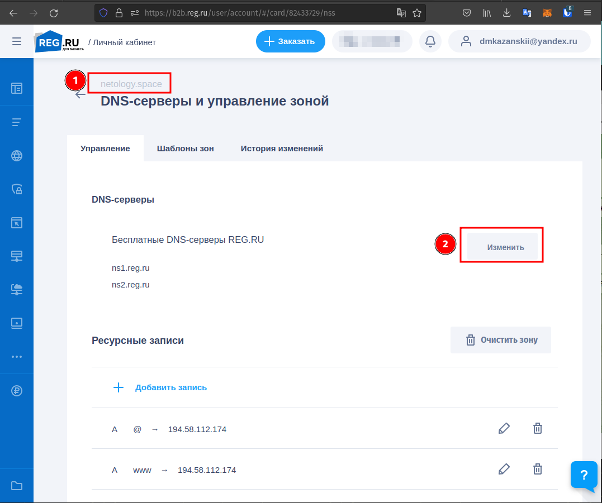
>  

_**2. Создание инфраструктуры**_

Для начала необходимо подготовить инфраструктуру в YC при помощи [Terraform](https://www.terraform.io).

_Особенности выполнения:_

-   Бюджет купона ограничен, что следует иметь в виду при проектировании инфраструктуры и использовании ресурсов;
-   Следует использовать последнюю стабильную версию Terraform.

_Предварительная подготовка:_

1.  Создайте сервисный аккаунт, который будет в дальнейшем использоваться Terraform для работы с инфраструктурой с необходимыми и достаточными правами. Не стоит использовать права суперпользователя
2.  Подготовьте [backend](https://www.terraform.io/language/settings/backends) для Terraform:

а. Рекомендуемый вариант: [Terraform Cloud](https://app.terraform.io)  
б. Альтернативный вариант: S3 bucket в созданном YC аккаунте.

3.  Настройте [workspaces](https://www.terraform.io/language/state/workspaces)

а. Рекомендуемый вариант: создайте два workspace: _stage_ и _prod_. В случае выбора этого варианта все последующие шаги должны учитывать факт существования нескольких workspace.  
б. Альтернативный вариант: используйте один workspace, назвав его _stage_. Пожалуйста, не используйте workspace, создаваемый Terraform-ом по-умолчанию (default).

4.  Создайте VPC с подсетями в разных зонах доступности.
5.  Убедитесь, что теперь вы можете выполнить команды `terraform destroy` и `terraform apply` без дополнительных ручных действий.
6.  В случае использования [Terraform Cloud](https://app.terraform.io) в качестве [backend](https://www.terraform.io/language/settings/backends) убедитесь, что применение изменений успешно проходит, используя web-интерфейс Terraform cloud.

_Цель:_

1.  Повсеместно применять IaaC подход при организации (эксплуатации) инфраструктуры.
2.  Иметь возможность быстро создавать (а также удалять) виртуальные машины и сети. С целью экономии денег на вашем аккаунте в YandexCloud.

_Ожидаемые результаты:_

1.  Terraform сконфигурирован и создание инфраструктуры посредством Terraform возможно без дополнительных ручных действий.
2.  Полученная конфигурация инфраструктуры является предварительной, поэтому в ходе дальнейшего выполнения задания возможны изменения.

> **Подготовка окружения**
> Зарезервирован статический адрес:

```bash
$ yc vpc address list --format yaml
- id: e9bj0srgkip14ia0gt1f
  folder_id: b1gslqvhkabm1n1mbf3j
  created_at: "2022-07-23T11:55:06Z"
  external_ipv4_address:
    address: 51.250.88.169
    zone_id: ru-central1-a
    requirements: {}
  reserved: true
  type: EXTERNAL
  ip_version: IPV4

```

> Используем вариант `YC` - S3 и **альтернативный** вариант: один workspace, назвав его `stage`:

```bash
$ terraform workspace list
* default

$ terraform workspace new stage
Created and switched to workspace "stage"!

You\'re now on a new, empty workspace. Workspaces isolate their state,
so if you run "terraform plan" Terraform will not see any existing state
for this configuration.

$ terraform workspace list
  default
* stage

```

> Создание `bucket` выполнил вручную:
 
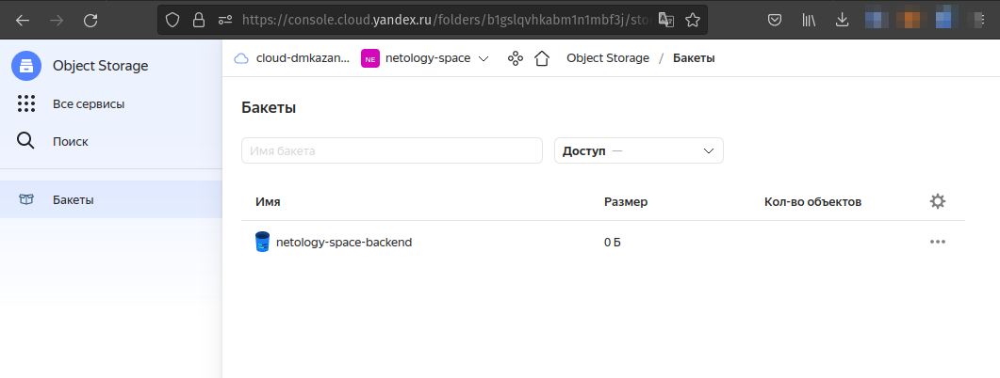

> Создаем статический ключ доступа для сервисного аккаунта в формате `json`:
> 

```json
~$ yc iam access-key create --service-account-name devops --format json
{
  "access_key": {
    "id": "aje6vhumr*******04ie",
    "service_account_id": "ajend9dn86*******e2t",
    "created_at": "2022-07-24T12:21:47.726615487Z",
    "key_id": "YCAJErEha0nSl***-Taui3KvB"
  },
  "secret": "YCMs6rXINdz_t37qRluxGys7RR1KTvz***8vARD8"
}

```
> 
> Создаем авторизованный ключ в формате `json`:

```bash
~$ yc iam key create --service-account-name devops -o netology-space-devops.json
id: aje3i795****qcl56hgs
service_account_id: ajend9dn***kpd769e2t
created_at: "2022-07-23T14:26:13.588153403Z"
key_algorithm: RSA_2048

```

>  полученный файл (`netology-space-devops.json`) укажу в качестве значения ключа  `service_account_key_file` блока `provider`.
>  
> получаем значения `yandex_cloud_id` и `yandex_folder_id`:

```bash 
$ yc resource-manager cloud list --format yaml
- id: b1g33tisd4sbvsb0acjg
  created_at: "2022-02-04T15:39:41Z"
  name: cloud-dmkazanskii
  organization_id: bpfljqa0tm5u23918fss


$ yc resource-manager folder list --format yaml
...
- id: b1gslqvhkabm1n1mbf3j
  cloud_id: b1g33tisd4sbvsb0acjg
  created_at: "2022-07-23T04:19:41Z"
  name: netology-space
  description: Дипломная работа курса DevOps инженер
  status: ACTIVE
...

```

> Полученные `id` ресурсов размещены в файле [`variables.tf`](terraform/variables.tf)
> Подготовлен файл [`main.tf`](terraform/main.tf) со следующим содержимым:

```json
# Provider

terraform {
  required_providers {
    yandex = {
      source = "yandex-cloud/yandex"
    }
  }
  required_version = ">= 0.13"

  backend "s3" {
      endpoint   = "storage.yandexcloud.net"
      bucket     = "netology-space-backend"
      region     = "ru-central1"
      key        = "terraform.tfstate"
      access_key = "YCAJErEha0nSl***-Taui3KvB"
      secret_key = "YCMs6rXINdz_t37qRluxGys7RR1KTvz***8vARD8"

      skip_region_validation      = true
      skip_credentials_validation = true
  }
}

provider "yandex" {
  service_account_key_file = "netology-space-devops.json"
  cloud_id                 = "${var.yandex_cloud_id}"
  folder_id                = "${var.yandex_folder_id}"
  zone                     = "${var.zones[0]}"
}

```

>  В результате применения плана `terraform apply -auto-approve`, в бакете `netology-space-backend` была созадана папка `stage` и в нее помещен файл состояний `terraform.tfstate`
>  

---

_**3. Установка Nginx и LetsEncrypt**_

Необходимо разработать Ansible роль для установки Nginx и LetsEncrypt.  
Для получения LetsEncrypt сертификатов во время тестов своего кода пользуйтесь [тестовыми сертификатами](https://letsencrypt.org/docs/staging-environment/), так как количество запросов к боевым серверам LetsEncrypt [лимитировано](https://letsencrypt.org/docs/rate-limits/).

_Рекомендации:_

• Имя сервера: `you.domain`  
• Характеристики: 2vCPU, 2 RAM, External address (Public) и Internal address.

_Цель:_

1.  Создать reverse proxy с поддержкой TLS для обеспечения безопасного доступа к веб-сервисам по HTTPS.

_Ожидаемые результаты:_

1.  В вашей доменной зоне настроены все A-записи на внешний адрес этого сервера:

-   `https://www.you.domain` (WordPress)
-   `https://gitlab.you.domain` (Gitlab)
-   `https://grafana.you.domain` (Grafana)
-   `https://prometheus.you.domain` (Prometheus)
-   `https://alertmanager.you.domain` (Alert Manager)

3.  Настроены все upstream для выше указанных URL, куда они сейчас ведут на этом шаге не важно, позже вы их отредактируете и укажите верные значения.
4.  В браузере можно открыть любой из этих URL и увидеть ответ сервера (502 Bad Gateway). На текущем этапе выполнение задания это нормально!

> С помощью команды ниже настроены все А-записи , настроены upstream, ответ сервера 502 Bad Gateway:
```bash
terraform$ ANSIBLE_FORCE_COLOR=1 ansible-playbook -v -i ../ansible/inventory/stage.yml --private-key ~/.ssh/netology.space ../ansible/nginx.yml
```

> Проверка:
> Запрос:

```bash
$ for sub in {'www','app','grafana','prometheus','alertmanager'}; do echo "= $sub info ==================="; curl --insecure -svoI https://$sub.netology.space 2>&1 | awk 'BEGIN { cert=0 } /^\* Server certificate/ { cert=1 } /^/ { if (cert) print }';done;
```

> Ответ:

```bash
= www info ===================
* Server certificate:
*  subject: CN=netology.space
*  start date: Jul 30 08:42:51 2022 GMT
*  expire date: Oct 28 08:42:50 2022 GMT
*  issuer: C=US; O=(STAGING) Let's Encrypt; CN=(STAGING) Artificial Apricot R3
*  SSL certificate verify result: unable to get local issuer certificate (20), continuing anyway.
} [5 bytes data]
> GET / HTTP/1.1
> Host: www.netology.space
> User-Agent: curl/7.83.1
> Accept: */*
> 
{ [5 bytes data]
* Mark bundle as not supporting multiuse
< HTTP/1.1 502 Bad Gateway
< Server: nginx
< Date: Sat, 30 Jul 2022 10:03:23 GMT
< Content-Type: text/html
< Content-Length: 150
< Connection: keep-alive
< 
{ [150 bytes data]
* Connection #0 to host www.netology.space left intact
= app info ===================
* Server certificate:
*  subject: CN=netology.space
*  start date: Jul 30 08:42:51 2022 GMT
*  expire date: Oct 28 08:42:50 2022 GMT
*  issuer: C=US; O=(STAGING) Let's Encrypt; CN=(STAGING) Artificial Apricot R3
*  SSL certificate verify result: unable to get local issuer certificate (20), continuing anyway.
} [5 bytes data]
> GET / HTTP/1.1
> Host: app.netology.space
> User-Agent: curl/7.83.1
> Accept: */*
> 
{ [5 bytes data]
* Mark bundle as not supporting multiuse
< HTTP/1.1 502 Bad Gateway
< Server: nginx
< Date: Sat, 30 Jul 2022 10:03:23 GMT
< Content-Type: text/html
< Content-Length: 150
< Connection: keep-alive
< 
{ [150 bytes data]
* Connection #0 to host app.netology.space left intact
= grafana info ===================
* Server certificate:
*  subject: CN=grafana.netology.space
*  start date: Jul 30 08:43:01 2022 GMT
*  expire date: Oct 28 08:43:00 2022 GMT
*  issuer: C=US; O=(STAGING) Let's Encrypt; CN=(STAGING) Artificial Apricot R3
*  SSL certificate verify result: unable to get local issuer certificate (20), continuing anyway.
} [5 bytes data]
> GET / HTTP/1.1
> Host: grafana.netology.space
> User-Agent: curl/7.83.1
> Accept: */*
> 
{ [5 bytes data]
* Mark bundle as not supporting multiuse
< HTTP/1.1 502 Bad Gateway
< Server: nginx
< Date: Sat, 30 Jul 2022 10:03:23 GMT
< Content-Type: text/html
< Content-Length: 150
< Connection: keep-alive
< 
{ [150 bytes data]
* Connection #0 to host grafana.netology.space left intact
= prometheus info ===================
* Server certificate:
*  subject: CN=prometheus.netology.space
*  start date: Jul 30 08:43:07 2022 GMT
*  expire date: Oct 28 08:43:06 2022 GMT
*  issuer: C=US; O=(STAGING) Let's Encrypt; CN=(STAGING) Artificial Apricot R3
*  SSL certificate verify result: unable to get local issuer certificate (20), continuing anyway.
} [5 bytes data]
> GET / HTTP/1.1
> Host: prometheus.netology.space
> User-Agent: curl/7.83.1
> Accept: */*
> 
{ [5 bytes data]
* Mark bundle as not supporting multiuse
< HTTP/1.1 502 Bad Gateway
< Server: nginx
< Date: Sat, 30 Jul 2022 10:03:24 GMT
< Content-Type: text/html
< Content-Length: 150
< Connection: keep-alive
< 
{ [150 bytes data]
* Connection #0 to host prometheus.netology.space left intact
= alertmanager info ===================
* Server certificate:
*  subject: CN=alertmanager.netology.space
*  start date: Jul 30 08:43:12 2022 GMT
*  expire date: Oct 28 08:43:11 2022 GMT
*  issuer: C=US; O=(STAGING) Let's Encrypt; CN=(STAGING) Artificial Apricot R3
*  SSL certificate verify result: unable to get local issuer certificate (20), continuing anyway.
} [5 bytes data]
> GET / HTTP/1.1
> Host: alertmanager.netology.space
> User-Agent: curl/7.83.1
> Accept: */*
> 
{ [5 bytes data]
* Mark bundle as not supporting multiuse
< HTTP/1.1 502 Bad Gateway
< Server: nginx
< Date: Sat, 30 Jul 2022 10:03:24 GMT
< Content-Type: text/html
< Content-Length: 150
< Connection: keep-alive
< 
{ [150 bytes data]
* Connection #0 to host alertmanager.netology.space left intact


```

---

**4. Установка кластера MySQL**

Необходимо разработать Ansible роль для установки кластера MySQL.

_Рекомендации:_

• Имена серверов: `db01.you.domain` и `db02.you.domain`  
• Характеристики: 4vCPU, 4 RAM, Internal address.

_Цель:_

1.  Получить отказоустойчивый кластер баз данных MySQL.

_Ожидаемые результаты:_

1.  MySQL работает в режиме репликации Master/Slave.
2.  В кластере автоматически создаётся база данных c именем `wordpress`.
3.  В кластере автоматически создаётся пользователь `wordpress` с полными правами на базу `wordpress` и паролем `wordpress`.

_Вы должны понимать, что в рамках обучения это допустимые значения, но в боевой среде использование подобных значений не приемлимо! Считается хорошей практикой использовать логины и пароли повышенного уровня сложности. В которых будут содержаться буквы верхнего и нижнего регистров, цифры, а также специальные символы!_

> **Запуск установки `кластера MySQL` выполняем вручную:**

```bash
$ ANSIBLE_FORCE_COLOR=1 ansible-playbook -v -i ../ansible/inventory/stage.yml --private-key ~/.ssh/netology.space ../ansible/mysql.yml

```

> **Лог выполнения:**
```bash

PLAY [mysql] *************************************************************

TASK [Gathering Facts] ***************************************************
ok: [db02]
ok: [db01]
...
TASK [install_mysql : Ensure MySQL databases are present.] **************
changed: [db02] => (item={'name': 'wordpress', 'collation': 'utf8_general_ci', 'encoding': 'utf8', 'replicate': 1})
changed: [db01] => (item={'name': 'wordpress', 'collation': 'utf8_general_ci', 'encoding': 'utf8', 'replicate': 1})
...
TASK [install_mysql : Ensure MySQL users are present.] *******************
changed: [db01] => (item={'name': 'wordpress', 'host': '%', 'password': 'wordpress', 'priv': '*.*:ALL PRIVILEGES'})
changed: [db02] => (item={'name': 'wordpress', 'host': '%', 'password': 'wordpress', 'priv': '*.*:ALL PRIVILEGES'})
changed: [db02] => (item={'name': 'repuser', 'password': 'repuser', 'priv': '*.*:REPLICATION SLAVE,REPLICATION CLIENT'})
changed: [db01] => (item={'name': 'repuser', 'password': 'repuser', 'priv': '*.*:REPLICATION SLAVE,REPLICATION CLIENT'})
changed: [db01] => (item={'name': 'exporter', 'password': 'password', 'priv': '*.*:REPLICATION CLIENT'})
changed: [db02] => (item={'name': 'exporter', 'password': 'password', 'priv': '*.*:REPLICATION CLIENT'})
...
PLAY RECAP *************************************************************************
db01: ok=39 changed=14 unreachable=0 failed=0 skipped=17 rescued=0 ignored=0   
db02: ok=42 changed=15 unreachable=0 failed=0 skipped=14 rescued=0  ignored=0

```

>  **Проверки:**
>  на Master:

```bash
$ ssh -i ~/.ssh/netology.space -o "ProxyCommand ssh -i ~/.ssh/netology.space -W %h:%p ubuntu@51.250.88.169" ubuntu@192.168.10.19

Welcome to Ubuntu 20.04.3 LTS (GNU/Linux 5.4.0-42-generic x86_64)
...
ubuntu@db01:~$
```

```mysql
mysql> SELECT user,authentication_string FROM mysql.user where user in ('wordpress');
+-----------+-------------------------------------------+
| user      | authentication_string                     |
+-----------+-------------------------------------------+
| wordpress | *C260A4F79FA905AF65142FFE0B9A14FE0E1519CC |
+-----------+-------------------------------------------+
1 row in set (0.00 sec)

mysql> SELECT SHA1(UNHEX(SHA1("wordpress")));
+------------------------------------------+
| SHA1(UNHEX(SHA1("wordpress")))           |
+------------------------------------------+
| c260a4f79fa905af65142ffe0b9a14fe0e1519cc |
+------------------------------------------+
1 row in set (0.00 sec)

```

```mysql

mysql> SHOW MASTER STATUS\G
*************************** 1. row ***************************
             File: mysql-bin.000002
         Position: 157
     Binlog_Do_DB: wordpress
 Binlog_Ignore_DB: 
Executed_Gtid_Set: 
1 row in set (0.00 sec)

```

```mysql
mysql> SHOW SLAVE HOSTS\G
*************************** 1. row ***************************
 Server_id: 2
      Host: 
      Port: 3306
 Master_id: 1
Slave_UUID: 26928013-0fef-11ed-96fa-d00d9f370c7f
1 row in set, 1 warning (0.00 sec)

```

> на Slave:

```bash
$ ssh -i ~/.ssh/netology.space -o "ProxyCommand ssh -i ~/.ssh/netology.space -W %h:%p ubuntu@51.250.88.169" ubuntu@192.168.10.27

Welcome to Ubuntu 20.04.3 LTS (GNU/Linux 5.4.0-42-generic x86_64)
...
ubuntu@db02:~$
```

```mysql

mysql> SELECT user,authentication_string FROM mysql.user where user in ('wordpress');
+-----------+-------------------------------------------+
| user      | authentication_string                     |
+-----------+-------------------------------------------+
| wordpress | *C260A4F79FA905AF65142FFE0B9A14FE0E1519CC |
+-----------+-------------------------------------------+
1 row in set (0.00 sec)

mysql> SELECT SHA1(UNHEX(SHA1("wordpress")));
+------------------------------------------+
| SHA1(UNHEX(SHA1("wordpress")))           |
+------------------------------------------+
| c260a4f79fa905af65142ffe0b9a14fe0e1519cc |
+------------------------------------------+
1 row in set (0.00 sec)

```

```mysql
mysql> SHOW MASTER STATUS\G
*************************** 1. row ***************************
             File: binlog.000005
         Position: 157
     Binlog_Do_DB: 
 Binlog_Ignore_DB: 
Executed_Gtid_Set: 
1 row in set (0.00 sec)

```

```mysql
mysql> SHOW SLAVE STATUS\G
*************************** 1. row ***************************
               Slave_IO_State: Waiting for source to send event
                  Master_Host: db01
                  Master_User: repuser
                  Master_Port: 3306
                Connect_Retry: 60
              Master_Log_File: mysql-bin.000002
          Read_Master_Log_Pos: 157
               Relay_Log_File: relay-bin.000005
                Relay_Log_Pos: 373
        Relay_Master_Log_File: mysql-bin.000002
             Slave_IO_Running: Yes
            Slave_SQL_Running: Yes
                   Last_Errno: 0
                 Skip_Counter: 0
          Exec_Master_Log_Pos: 157
              Relay_Log_Space: 746
              Until_Condition: None
                Until_Log_Pos: 0
           Master_SSL_Allowed: No
        Seconds_Behind_Master: 0
Master_SSL_Verify_Server_Cert: No
                Last_IO_Errno: 0
               Last_SQL_Errno: 0
             Master_Server_Id: 1
                  Master_UUID: 26eb9018-0fef-11ed-853d-d00dbd7cf051
             Master_Info_File: mysql.slave_master_info
                    SQL_Delay: 0
          SQL_Remaining_Delay: NULL
      Slave_SQL_Running_State: Replica has read all relay log; waiting for more updates
           Master_Retry_Count: 86400
                Auto_Position: 0
        Get_master_public_key: 0
1 row in set, 1 warning (0.00 sec)

```

---

**5. Установка WordPress**

Необходимо разработать Ansible роль для установки WordPress.

_Рекомендации:_

• Имя сервера: `app.you.domain`  
• Характеристики: 4vCPU, 4 RAM, Internal address.

_Цель:_

1.  Установить [WordPress](https://wordpress.org/download/). Это система управления содержимым сайта ([CMS](https://ru.wikipedia.org/wiki/%D0%A1%D0%B8%D1%81%D1%82%D0%B5%D0%BC%D0%B0_%D1%83%D0%BF%D1%80%D0%B0%D0%B2%D0%BB%D0%B5%D0%BD%D0%B8%D1%8F_%D1%81%D0%BE%D0%B4%D0%B5%D1%80%D0%B6%D0%B8%D0%BC%D1%8B%D0%BC)) с открытым исходным кодом.

По данным W3techs, WordPress используют 64,7% всех веб-сайтов, которые сделаны на CMS. Это 41,1% всех существующих в мире сайтов. Эту платформу для своих блогов используют The New York Times и Forbes. Такую популярность WordPress получил за удобство интерфейса и большие возможности.

_Ожидаемые результаты:_

1.  Виртуальная машина на которой установлен WordPress и Nginx/Apache (на ваше усмотрение).
2.  В вашей доменной зоне настроена A-запись на внешний адрес reverse proxy:

-   `https://www.you.domain` (WordPress)

3.  На сервере `you.domain` отредактирован upstream для выше указанного URL и он смотрит на виртуальную машину на которой установлен WordPress.
4.  В браузере можно открыть URL `https://www.you.domain` и увидеть главную страницу WordPress.

> **Запуск установки `wordpress` выполняем вручную:**

```bash
terraform$ ANSIBLE_FORCE_COLOR=1 ansible-playbook -i ../ansible/hosts --private-key  /home/$(whoami)/.ssh/netology.space ../ansible/wordpress.yml

```

> **Лог выполнения:**
```bash

PLAY [app] ***************************************************************

TASK [Gathering Facts] ***************************************************
ok: [app]
....

PLAY RECAP ***************************************************************
app: ok=15 changed=13 unreachable=0 failed=0 skipped=0 rescued=0 ignored=0

```


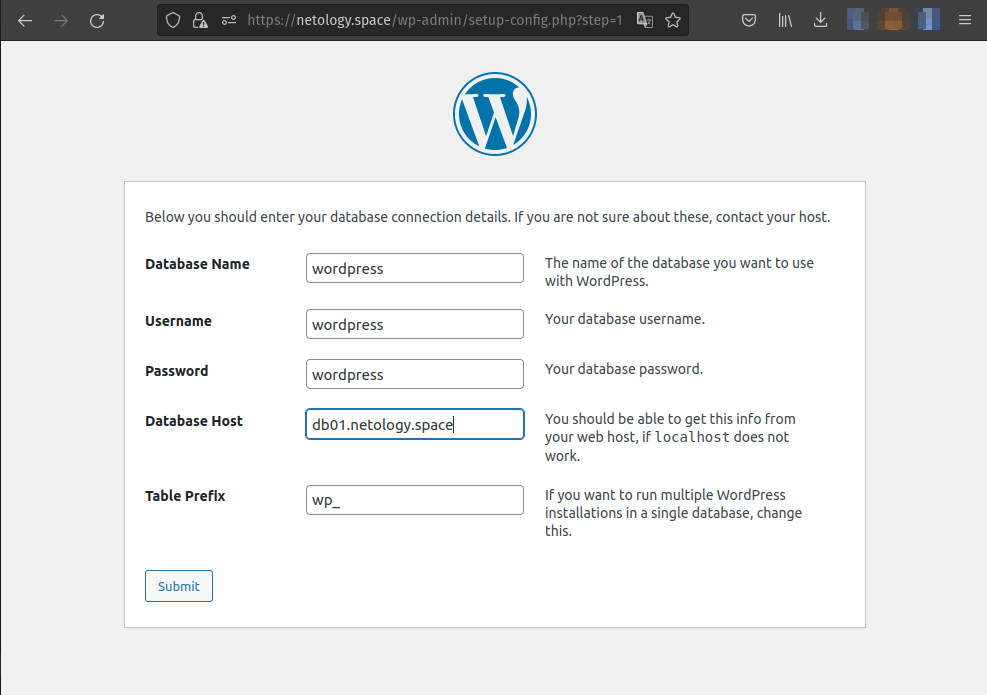

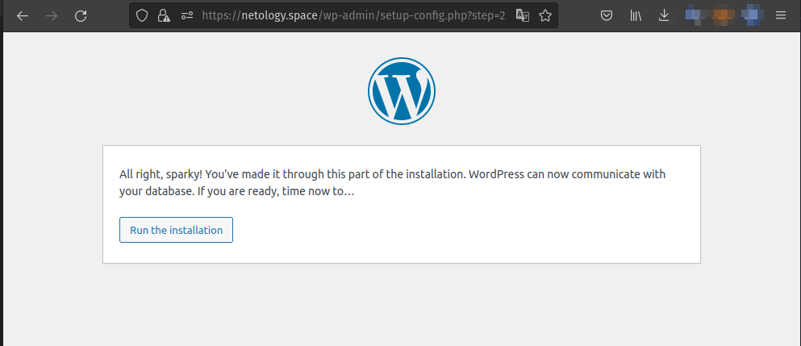

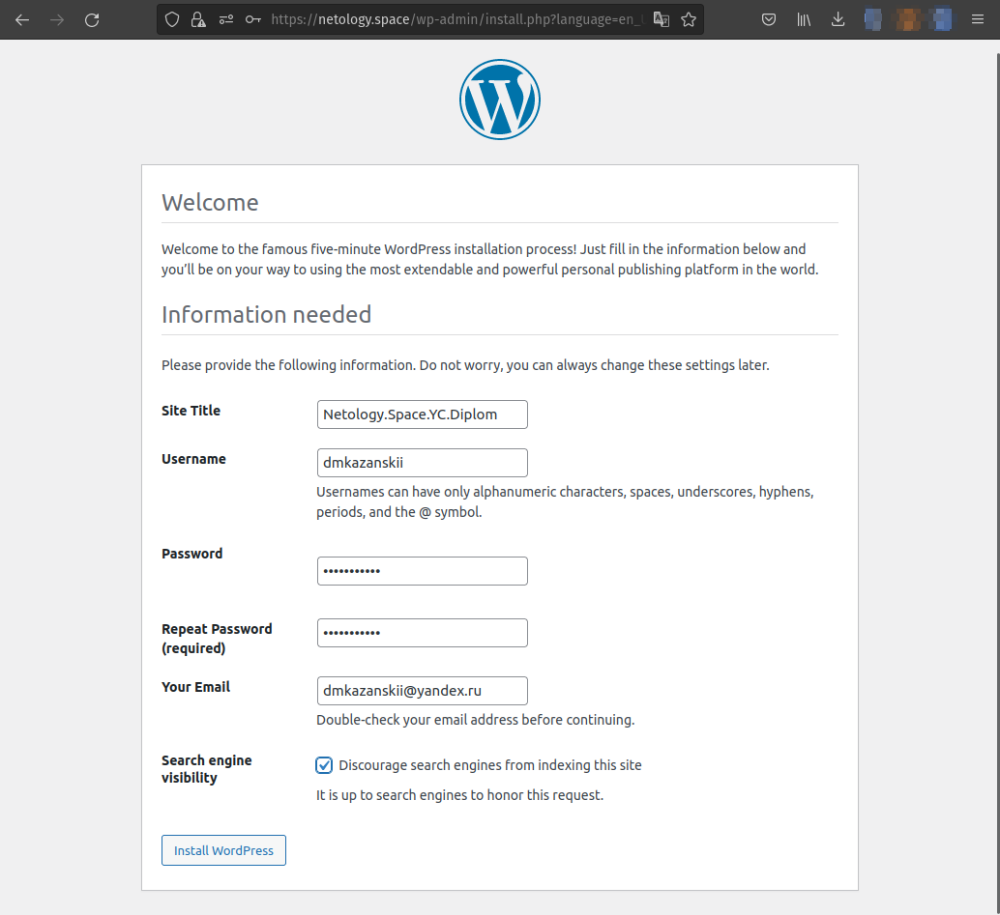

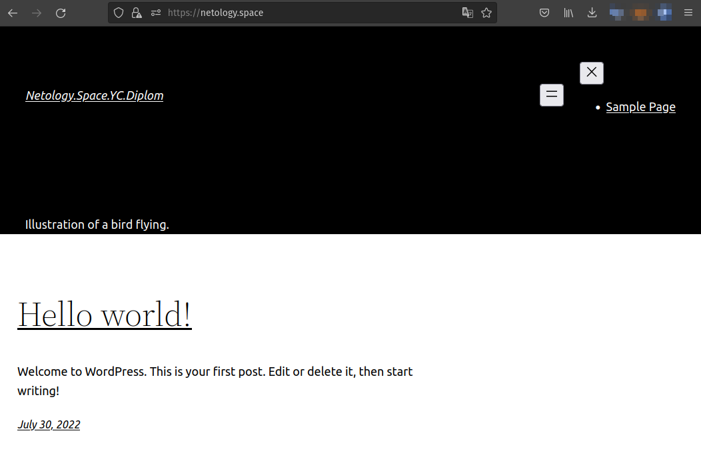

---

**6. Установка Gitlab CE и Gitlab Runner**

Необходимо настроить CI/CD систему для автоматического развертывания приложения при изменении кода.

_Рекомендации:_

• Имена серверов: `gitlab.you.domain` и `runner.you.domain`  
• Характеристики: 4vCPU, 4 RAM, Internal address.

_Цель:_

1.  Построить pipeline доставки кода в среду эксплуатации, то есть настроить автоматический деплой на сервер app.you.domain при коммите в репозиторий с WordPress.  
    Подробнее о [Gitlab CI](https://about.gitlab.com/stages-devops-lifecycle/continuous-integration/)

_Ожидаемый результат:_

1.  Интерфейс Gitlab доступен по https.
2.  В вашей доменной зоне настроена A-запись на внешний адрес reverse proxy:

-   `https://gitlab.you.domain` (Gitlab)

3.  На сервере `you.domain` отредактирован upstream для выше указанного URL и он смотрит на виртуальную машину на которой установлен Gitlab.
4.  При любом коммите в репозиторий с WordPress и создании тега (например, v1.0.0) происходит деплой на виртуальную машину.

> Для установки `GitLab-CE` выполняем ручной запуск playbook `gitlab.yml`:

```bash
terraform$ ANSIBLE_FORCE_COLOR=1 ansible-playbook -vvv -i ../ansible/inventory/stage.yml --private-key ~/.ssh/netology.space ../ansible/gitlab.yml
```

> В журнале выполнения находим пароль для `первого входа в систему`,
> заходим в систему и меняем пароль пользователя `root`.


```bash
TASK [gitlab : debug] ****************************************************

ok: [gitlab] => {
"command_output.stdout_lines": [
"# WARNING: This value is valid only in the following conditions",
"# 1. If provided manually (either via `GITLAB_ROOT_PASSWORD` environment variable or via `gitlab_rails['initial_root_password']` setting in `gitlab.rb`, it was provided before database was seeded for the first time (usually, the first reconfigure run).",
"# 2. Password hasn't been changed manually, either via UI or via command line.",
"#",
"# If the password shown here doesn't work, you must reset the admin password following https://docs.gitlab.com/ee/security/reset_user_password.html#reset-your-root-password.",
"",
"Password: WR82+/togwJFsJkT6uhaN+t68TpBzSe++Ls/c0u4lYU=",
"",
"# NOTE: This file will be automatically deleted in the first reconfigure run after 24 hours."
    ]
}

...

PLAY RECAP ***************************************************************
gitlab: ok=16 changed=10 unreachable=0 failed=0 skipped=3 rescued=0 ignored=0   

```

> С помощью `Gitlab UI` создаем новый проект `Wordpress` и переходим к настройке `Specific runner`

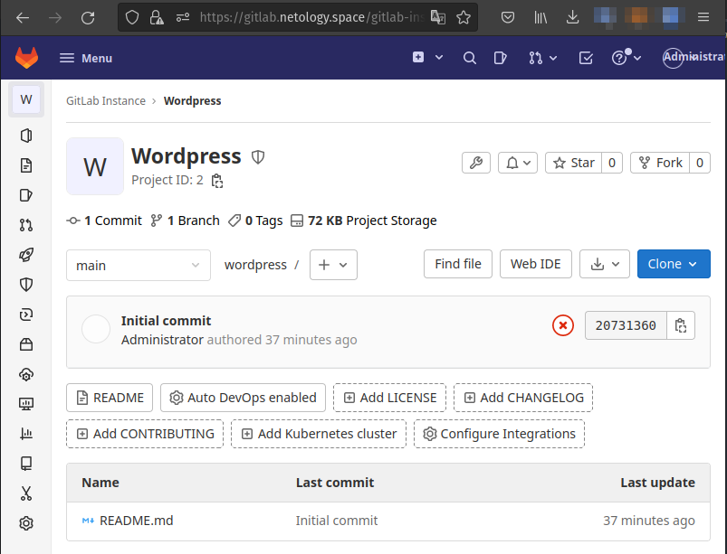

> устанавливаем `gitlab-runner` с помощью запуска playbook, предварительно указав `specific runner for a project`:

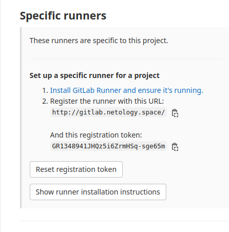

```bash
terraform$ ANSIBLE_FORCE_COLOR=1 ansible-playbook -i ../ansible/hosts --private-key  /home/$(whoami)/.ssh/netology.space ../ansible/runner.yml
```

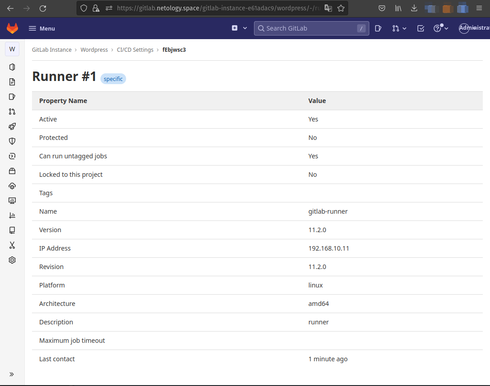

> Настраиваем репозиторий, на сервере `app.netology.space` (используем подготовленный с помощью `terraform` файл `stage_ssh.txt`)

```bash 
#wordpress-install:
#app:
$ ssh -i ~/.ssh/netology.space -o "ProxyCommand ssh -i ~/.ssh/netology.space -W %h:%p ubuntu@51.250.88.169" ubuntu@192.168.10.19

...
# Последовательно выполняем команды:

ubuntu@app: cd /var/www/wordpress/
ubuntu@app: sudo git init
ubuntu@app:/var/www/wordpress$ sudo touch .gitignore
ubuntu@app:/var/www/wordpress$ sudo nano .gitignore
# содержимое файла забираем здесь: https://raw.githubusercontent.com/github/gitignore/main/WordPress.gitignore

ubuntu@app:/var/www/wordpress$ sudo git config --global --add safe.directory /var/www/wordpress
ubuntu@app:/var/www/wordpress$ sudo git remote add origin http://gitlab.netology.space/gitlab-instance-e61adac9/wordpress.git
ubuntu@app:/var/www/wordpress$ sudo git remote add origin http://gitlab.netology.space/gitlab-instance-e61adac9/wordpress.git
ubuntu@app:/var/www/wordpress$ git config --global --add safe.directory /var/www/wordpress
ubuntu@app:/var/www/wordpress$ sudo git add .


ubuntu@app:/var/www/wordpress$ sudo git add .
ubuntu@app:/var/www/wordpress$ sudo git commit -m 'init wp project'
ubuntu@app:/var/www/wordpress$ sudo git push origin master
Username for 'http://gitlab.netology.space': root
Password for 'http://root@gitlab.netology.space': 
Everything up-to-date
ubuntu@app:/var/www/wordpress$ git status
On branch master

```

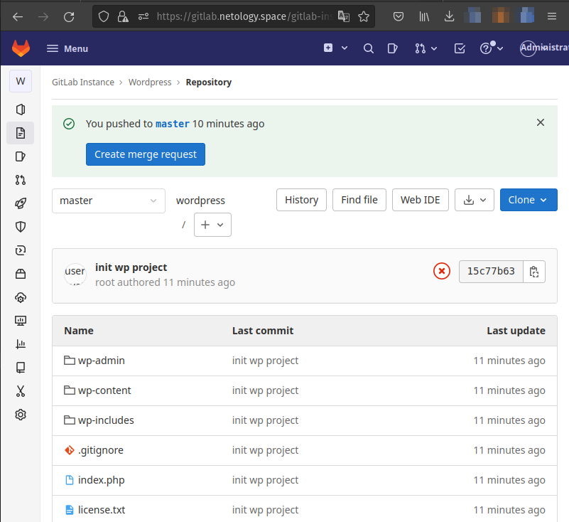


> add `.gitlab-ci.yml` 

```yaml
---

variables:
	CI_DEBUG_TRACE: "true"

before_script:
	- eval $(ssh-agent -s)
	- echo "$ssh_key" | tr -d '\r' | ssh-add -
	- mkdir -p ~/.ssh
	- chmod 700 ~/.ssh
	- echo $CI_COMMIT_REF_NAME
	- echo $CI_CONFIG_PATH
stages:
	- deploy
deploy-job:
	stage: deploy
	script:
		- echo "Deploying application..."
		- ssh -o StrictHostKeyChecking=no ubuntu@app sudo chown ubuntu /var/www/wordpress/ -R
		- rsync -rvz -e "ssh -o StrictHostKeyChecking=no" ./* ubuntu@app:/var/www/wordpress/
		- ssh -o StrictHostKeyChecking=no ubuntu@app sudo chown www-data /var/www/wordpress/ -R

```

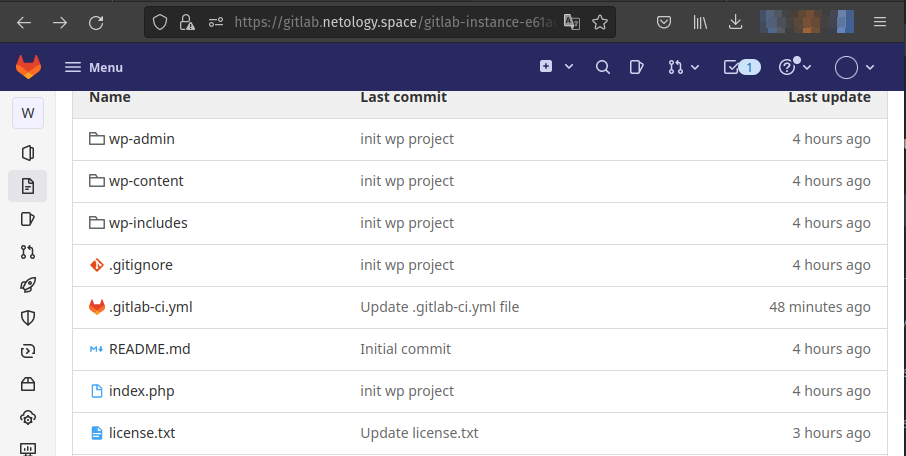

---

**7. Установка Prometheus, Alert Manager, Node Exporter и Grafana**

Необходимо разработать Ansible роль для установки Prometheus, Alert Manager и Grafana.

_Рекомендации:_

• Имя сервера: `monitoring.you.domain`  
• Характеристики: 4vCPU, 4 RAM, Internal address.

_Цель:_

1.  Получение метрик со всей инфраструктуры.

_Ожидаемые результаты:_

1.  Интерфейсы Prometheus, Alert Manager и Grafana доступены по https.
2.  В вашей доменной зоне настроены A-записи на внешний адрес reverse proxy:  
    • `https://grafana.you.domain` (Grafana)  
    • `https://prometheus.you.domain` (Prometheus)  
    • `https://alertmanager.you.domain` (Alert Manager)
3.  На сервере `you.domain` отредактированы upstreams для выше указанных URL и они смотрят на виртуальную машину на которой установлены Prometheus, Alert Manager и Grafana.
4.  На всех серверах установлен Node Exporter и его метрики доступны Prometheus.
5.  У Alert Manager есть необходимый [набор правил](https://awesome-prometheus-alerts.grep.to/rules.html) для создания алертов.
6.  В Grafana есть дашборд отображающий метрики из Node Exporter по всем серверам.
7.  В Grafana есть дашборд отображающий метрики из MySQL (*).
8.  В Grafana есть дашборд отображающий метрики из WordPress (*).

_Примечание: дашборды со звёздочкой являются опциональными заданиями повышенной сложности их выполнение желательно, но не обязательно._

> Для установки `Prometheus, Alert Manager, Grafana` выполняем ручной запуск playbook `monitoring.yml`:

```bash
$ ANSIBLE_FORCE_COLOR=1 ansible-playbook -i ../ansible/inventory/stage.yml --private-key /home/arcdm/.ssh/netology.space ../ansible/monitoring.yml
```

> Лог выполнения:

```bash
PLAY [monitoring] ********************************************************

TASK [Gathering Facts] ***************************************************
ok: [monitoring.netology.space]

...

TASK [monitoring : Allow Ports] ******************************************
skipping: [monitoring.netology.space] => (item=9090/tcp) 
skipping: [monitoring.netology.space] => (item=9093/tcp) 
skipping: [monitoring.netology.space] => (item=9094/tcp) 
skipping: [monitoring.netology.space] => (item=9100/tcp) 
skipping: [monitoring.netology.space] => (item=9094/udp) 

...
PLAY RECAP ***************************************************************
monitoring.netology.space: ok=28   changed=23   unreachable=0    failed=0    skipped=8    rescued=0    ignored=0   

```

> Для установки `Nodeexporter` выполняем ручной запуск playbook `nodeexporter.yml`:

```bash
$ ANSIBLE_FORCE_COLOR=1 ansible-playbook -i ../ansible/inventory/stage.yml --private-key /home/arcdm/.ssh/netology.space ../ansible/nodeexporter.yml
```

> Лог выполнения:

```bash
PLAYBOOK: nodeexporter.yml ***********************************************
1 plays in ../ansible/nodeexporter.yml

PLAY [nodeexporter] ******************************************************

TASK [Gathering Facts] ***************************************************

...
PLAY RECAP ***************************************************************
app: ok=16   changed=7    unreachable=0    failed=0    skipped=16   rescued=0    ignored=0
nodeexporter: ok=16   changed=7    unreachable=0    failed=0    skipped=16   rescued=0    ignored=0
db01: ok=16   changed=7    unreachable=0    failed=0    skipped=16   rescued=0    ignored=0   
db02: ok=15   changed=7    unreachable=0    failed=0    skipped=14   rescued=0    ignored=0   
gitlab : ok=16   changed=7    unreachable=0    failed=0    skipped=16   rescued=0    ignored=0    
runner : ok=16   changed=7    unreachable=0    failed=0    skipped=16   rescued=0    ignored=0   

```

>  Скриншот веб-интерфейса `Prometheus` :

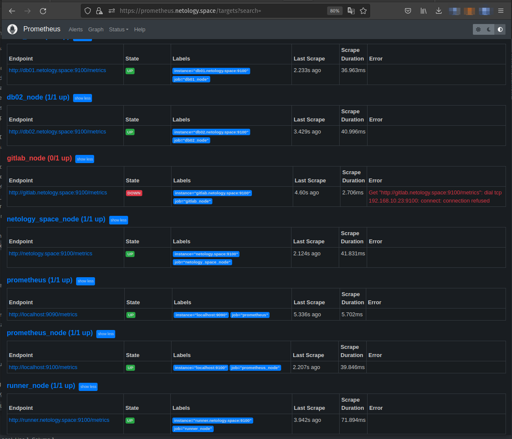


>  Скриншот веб-интерфейса `Grafana - MySQL (db01,db02)` :

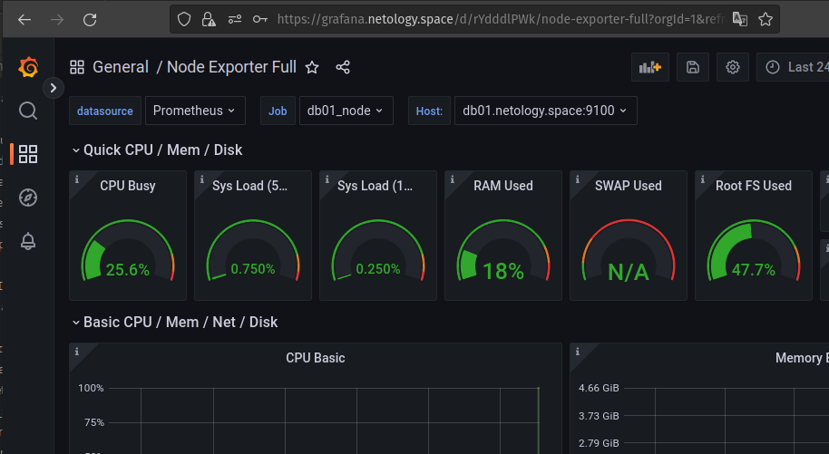

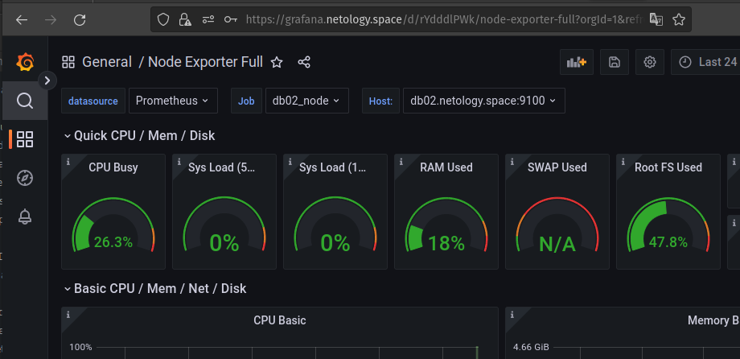

>  Скриншот веб-интерфейса `Grafana - Wordpress` :


>  Скриншот веб-интерфейса `Alertmanager` :

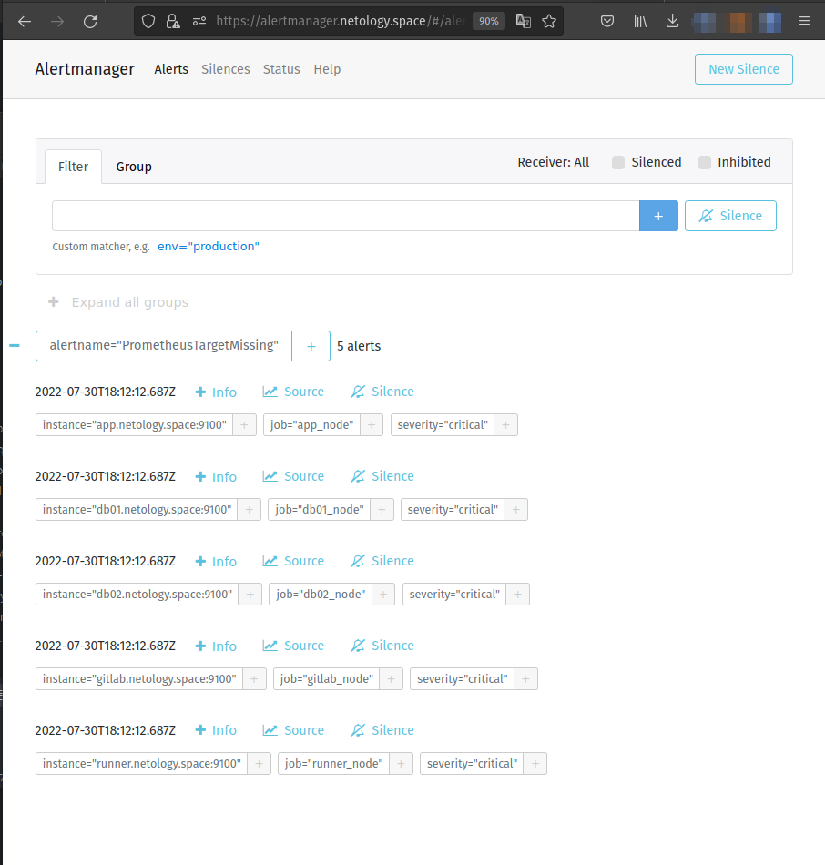


##  Используемые статьи

[# Gitlan role ansible](https://github.com/geerlingguy/ansible-role-gitlab)
```
ogin: root
asswd: 5iveL!fe
```
[# How To Set Up a Continuous Deployment Pipeline with GitLab CI/CD on Ubuntu 18.04](https://www.digitalocean.com/community/tutorials/how-to-set-up-a-continuous-deployment-pipeline-with-gitlab-ci-cd-on-ubuntu-18-04)
[# MySQL Show User Privileges](https://phoenixnap.com/kb/mysql-show-user-privileges)
[riemers/ansible-gitlab-runner](https://github.com/riemers/ansible-gitlab-runner)

---

**Что необходимо для сдачи задания?**

1.  Репозиторий со всеми Terraform манифестами и готовность продемонстрировать создание всех ресурсов с нуля.
2.  Репозиторий со всеми Ansible ролями и готовность продемонстрировать установку всех сервисов с нуля.
3.  Скриншоты веб-интерфейсов всех сервисов работающих по HTTPS на вашем доменном имени.

-   `https://www.you.domain` (WordPress)
-   `https://gitlab.you.domain` (Gitlab)
-   `https://grafana.you.domain` (Grafana)
-   `https://prometheus.you.domain` (Prometheus)
-   `https://alertmanager.you.domain` (Alert Manager)

5.  Все репозитории рекомендуется хранить на одном из ресурсов ([github.com](https://github.com) или [gitlab.com](https://about.gitlab.com)).